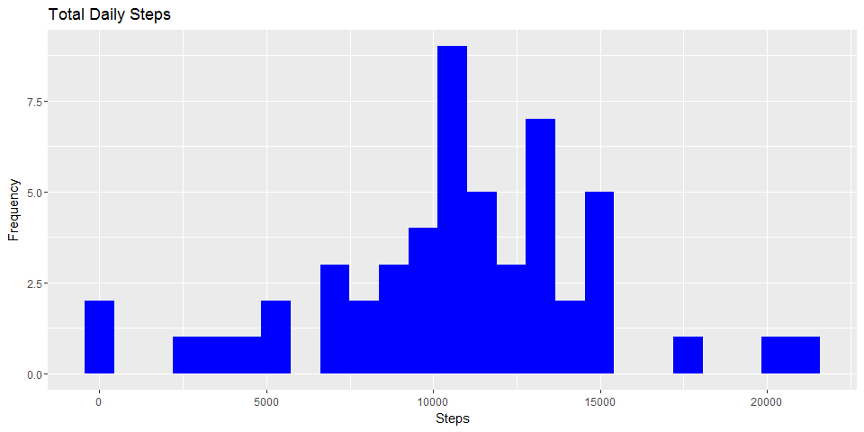
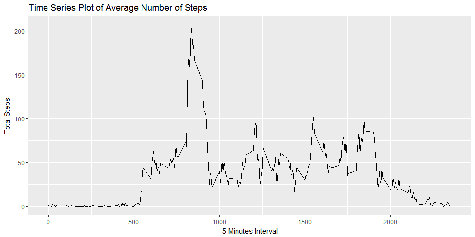
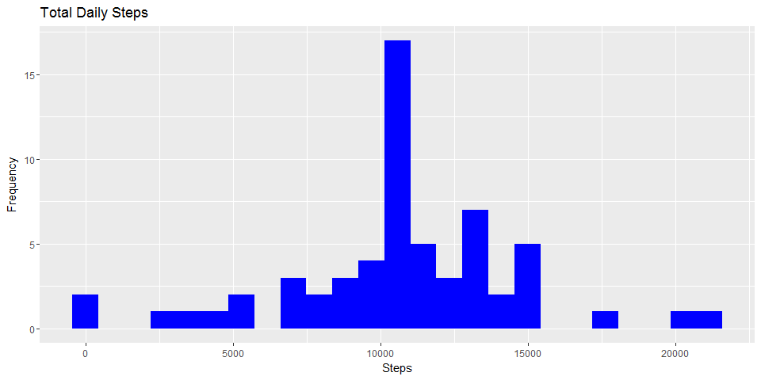
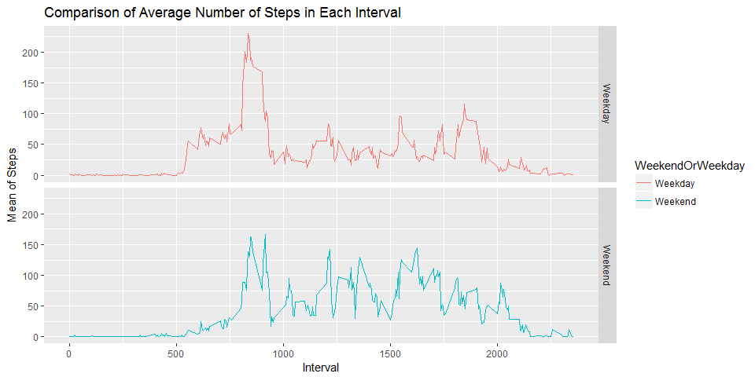

# Week 2, Course Project 1 


```r
# load packages
library (ggplot2)
```

```
## Warning: package 'ggplot2' was built under R version 3.4.3
```

```r
library (dplyr)
```

```
## Warning: package 'dplyr' was built under R version 3.4.2
```

```
## 
## Attaching package: 'dplyr'
```

```
## The following objects are masked from 'package:stats':
## 
##     filter, lag
```

```
## The following objects are masked from 'package:base':
## 
##     intersect, setdiff, setequal, union
```

```r
# set working directory
setwd("~/Data Science/Module 5 - Reproducible Research/Wk2/activity")
```

## Loading and preprocessing the data

Show any code that is needed to

1. Load the data (i.e. read.csv())
2. Process/transform the data (if necessary) into a format suitable for your analysis

```r
# Read file
rawdata <- read.csv ("activity.csv")
# See rawdata
head(rawdata)
```

```
##   steps       date interval
## 1    NA 2012-10-01        0
## 2    NA 2012-10-01        5
## 3    NA 2012-10-01       10
## 4    NA 2012-10-01       15
## 5    NA 2012-10-01       20
## 6    NA 2012-10-01       25
```

### What is mean total number of steps taken per day?

For this part of the assignment, you can ignore the missing values in the dataset.

1. Calculate the total number of steps taken per day


```r
# Aggregate steps by date
agg <- aggregate(rawdata$steps, by=list(Date=rawdata$date), FUN=sum)
# Rename third column Total
names(agg)[2] <- "Total"
# See aggregate data
head(agg)
```

```
##         Date Total
## 1 2012-10-01    NA
## 2 2012-10-02   126
## 3 2012-10-03 11352
## 4 2012-10-04 12116
## 5 2012-10-05 13294
## 6 2012-10-06 15420
```

2. If you do not understand the difference between a histogram and a barplot, research the difference between them. Make a histogram of the total number of steps taken each day


```r
# histogram of aggregated data
histogram <- ggplot(data = na.omit(agg), aes(Total)) + geom_histogram(bins=25, fill="blue")+labs(title="Total Daily Steps", x="Steps", y="Frequency")
histogram
```

<!-- -->

3. Calculate and report the mean and median of the total number of steps taken per day


```r
# Mean steps per day
mean(agg$Total, na.rm=TRUE)
```

```
## [1] 10766.19
```

```r
# Median steps per day
median(agg$Total, na.rm=TRUE)
```

```
## [1] 10765
```

### What is the average daily activity pattern?
1. Make a time series plot (i.e. type = "l") of the 5-minute interval (x-axis) and the average number of steps taken, averaged across all days (y-axis)


```r
# Aggregate steps by 5-minute interval
five <- aggregate(steps ~ interval, data=rawdata, FUN=mean)

# Time series plot of the average number of steps taken per day
timeseries <- ggplot(data=five, aes(x=interval, y=steps)) + geom_line() + labs(title="Time Series Plot of Average Number of Steps", x="5 Minutes Interval", y="Total Steps")
timeseries
```

<!-- -->

2. Which 5-minute interval, on average across all the days in the dataset, contains the maximum number of steps?


```r
five[which(five$steps == max(five$steps)),]
```

```
##     interval    steps
## 104      835 206.1698
```

### Imputing missing values
Note that there are a number of days/intervals where there are missing values (coded as NA). The presence of missing days may introduce bias into some calculations or summaries of the data.

1. Calculate and report the total number of missing values in the dataset (i.e. the total number of rows with NAs)


```r
missing_data<-sum(is.na(rawdata))
missing_data
```

```
## [1] 2304
```


2. Devise a strategy for filling in all of the missing values in the dataset. The strategy does not need to be sophisticated. For example, you could use the mean/median for that day, or the mean for that 5-minute interval, etc.

Strategy: Used the mean for 5-minute interval to replace.


```r
# Replace with mean
replacewithmean <- function(x) replace(x, is.na(x), mean(x, na.rm = TRUE))
meandata <- rawdata%>% group_by(interval) %>% mutate(steps= replacewithmean(steps))
```

```
## Warning: package 'bindrcpp' was built under R version 3.4.2
```


3. Create a new dataset that is equal to the original dataset but with the missing data filled in.


```r
# aggregate mean data
aggmean <- aggregate(meandata$steps, by=list(Date=rawdata$date), FUN=sum)
# Rename third column Total
names(aggmean)[2] <- "Total"
```


4. Make a histogram of the total number of steps taken each day and Calculate and report the mean and median total number of steps taken per day. Do these values differ from the estimates from the first part of the assignment? What is the impact of imputing missing data on the estimates of the total daily number of steps?


```r
histogram2 <- ggplot(data = aggmean, aes(Total))+geom_histogram(bins=25, fill="blue")+labs(title="Total Daily Steps", x="Steps", y="Frequency")
histogram2
```

<!-- -->


```r
# Mean steps per day
mean(aggmean$Total, na.rm=TRUE)
```

```
## [1] 10766.19
```

```r
# Median steps per day
median(aggmean$Total, na.rm=TRUE)
```

```
## [1] 10766.19
```

Compared to earlier vaulues, no change in mean. However, the median increased by 1.19 steps.

### Are there differences in activity patterns between weekdays and weekends?
For this part the weekdays() function may be of some help here. Use the dataset with the filled-in missing values for this part.

1. Create a new factor variable in the dataset with two levels - "weekday" and "weekend" indicating whether a given date is a weekday or weekend day.


```r
meandata$WeekendOrWeekday <- ifelse(weekdays(as.Date(meandata$date)) %in% c("Monday", "Tuesday", "Wednesday", "Thursday", "Friday"), "Weekday", "Weekend")
head(meandata)
```

```
## # A tibble: 6 x 4
## # Groups:   interval [6]
##       steps       date interval WeekendOrWeekday
##       <dbl>     <fctr>    <int>            <chr>
## 1 1.7169811 2012-10-01        0          Weekday
## 2 0.3396226 2012-10-01        5          Weekday
## 3 0.1320755 2012-10-01       10          Weekday
## 4 0.1509434 2012-10-01       15          Weekday
## 5 0.0754717 2012-10-01       20          Weekday
## 6 2.0943396 2012-10-01       25          Weekday
```


2. Make a panel plot containing a time series plot (i.e. type = "l") of the 5-minute interval (x-axis) and the average number of steps taken, averaged across all weekday days or weekend days (y-axis). See the README file in the GitHub repository to see an example of what this plot should look like using simulated data.


```r
# Aggregate meandata steps by Weekend/weekday and interval
aggmeandata <- aggregate(meandata$steps, by=list(meandata$WeekendOrWeekday, meandata$interval), mean)
# See aggmeandata
head(aggmeandata)
```

```
##   Group.1 Group.2          x
## 1 Weekday       0 2.25115304
## 2 Weekend       0 0.21462264
## 3 Weekday       5 0.44528302
## 4 Weekend       5 0.04245283
## 5 Weekday      10 0.17316562
## 6 Weekend      10 0.01650943
```

```r
# Rename columns of aggmeandata
names(aggmeandata)[1] <- "WeekendOrWeekday"
names(aggmeandata)[2] <- "Interval"
names(aggmeandata)[3] <- "Steps"
# See aggmeandata with renamed columns
head(aggmeandata)
```

```
##   WeekendOrWeekday Interval      Steps
## 1          Weekday        0 2.25115304
## 2          Weekend        0 0.21462264
## 3          Weekday        5 0.44528302
## 4          Weekend        5 0.04245283
## 5          Weekday       10 0.17316562
## 6          Weekend       10 0.01650943
```

```r
# Plot aggmeandata
ggplot(aggmeandata, aes(x=Interval, y=Steps, color=WeekendOrWeekday)) + geom_line()+
  facet_grid(WeekendOrWeekday ~.) + xlab("Interval") + ylab("Mean of Steps") +
  ggtitle("Comparison of Average Number of Steps in Each Interval")
```

<!-- -->
